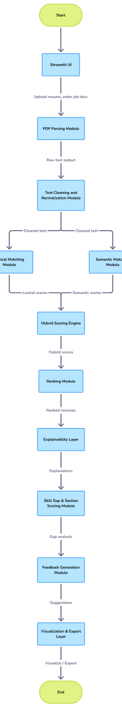

# Hybrid Lexical–Semantic Matching with Explainability and Feedback

A hybrid candidate–role matching system that integrates **lexical relevance modeling** and
**semantic similarity estimation** to rank resumes against a job description, provide
sentence-level explainability, and generate deterministic resume improvement feedback.

The system is implemented as an **interpretable NLP pipeline**, prioritizing transparency,
modularity, and controllable decision logic over black-box end-to-end models.

---

## System Architecture



---

## Methodology

The system follows a multi-stage hybrid matching pipeline:

### 1. Lexical Matching
- Resume and job description texts are vectorized using TF-IDF with unigram and bigram features.
- Lexical relevance is computed using cosine similarity.

### 2. Semantic Matching
- Sentence-level transformer embeddings are generated using a lightweight MiniLM model.
- Semantic relevance is computed via cosine similarity in embedding space.

### 3. Hybrid Scoring
- Lexical and semantic scores are combined using weighted linear aggregation.
- Enables controlled trade-offs between keyword overlap and contextual similarity.

### 4. Explainability Layer
- Resume sentences are ranked by semantic similarity to the job description.
- Top contributing sentences are surfaced to justify ranking decisions.

### 5. Feedback Generation
- Skill gaps are identified via set-based comparison between resume and job description skills.
- Section-level relevance scores detect weak resume areas.
- Deterministic rules generate actionable resume improvement suggestions.

---

## Design Rationale

- A hybrid lexical–semantic approach balances precision (keyword relevance) and recall (contextual meaning).
- Transformer embeddings are used strictly for representation, not generation.
- Rule-based feedback preserves explainability and deterministic behavior.
- Optimized for small-batch resume screening (10–20 resumes).

---

## System Workflow

1. User uploads multiple resume PDFs and provides a job description
2. Text is extracted from each resume
3. Text is cleaned and normalized
4. Lexical and semantic relevance are computed in parallel
5. Hybrid scores are aggregated
6. Resumes are ranked by final relevance score
7. Explainability and skill-gap analysis are applied to top-ranked resumes
8. Results are visualized and exported

---

## Project Structure

app/
├── main.py # Streamlit entry point
├── ui/
│ └── charts.py # Visualization logic
└── utils/
├── pdf_parser.py # PDF text extraction
├── text_cleaning.py # Text preprocessing
├── scoring.py # TF-IDF + similarity scoring
├── embedding_scoring.py# Semantic embedding scoring
├── section_extraction.py
├── section_scoring.py
├── explainability.py # Sentence-level explanations
└── suggestions.py # Resume improvement feedback
---

## Technologies Used

- Python
- Streamlit
- Scikit-learn
  - TF-IDF Vectorizer
  - Cosine Similarity
- Sentence-Transformers (MiniLM)
- Pandas
- Matplotlib
- PyPDF2

---

## Technical Details

### Text Processing
- Case normalization
- Noise and punctuation removal
- Lightweight tokenization
- Custom minimal stopword filtering

### Vectorization
- TF-IDF with unigram and bigram support
- Vocabulary learned jointly from resumes and job description

### Scoring
- Cosine similarity between resume and job description vectors
- Scores scaled to percentage for interpretability

### Section and Skill Extraction
- Heuristic-based section heading detection
- Skill extraction using a curated technical skill vocabulary
- Fallback inference when explicit headings are missing

---

## How to Run Locally

1. Clone the repository:
   ```bash
   git clone https://github.com/shravan606756/hybrid-lexical-semantic-matching.git
   cd hybrid-lexical-semantic-matching

2. Create and activate virtual environment:
  ```bash
  python -m venv .venv
.\.venv\Scripts\Activate.ps1

3.Install dependencies:
  ```bash
  pip install -r requirements.txt

4. Run the application:
  ```bash
  streamlit run app/main.py

Use Cases

Resume shortlisting for internships and entry-level roles

Skill relevance analysis for students

Demonstration of applied NLP system design

Academic mini-project or placement portfolio project

Limitations

Skill extraction depends on a predefined vocabulary

Section detection is heuristic-based

Not intended for large-scale enterprise ATS systems

Future Enhancements

Section-wise similarity weighting

Custom skill vocabulary input

Resume-to-resume similarity detection

Highlighting matched keywords in resumes

Author

Developed as an applied Natural Language Processing project with emphasis on
interpretable scoring, modular design, and explainable decision-making.

---

## 3️⃣ Final checklist before commit

- [ ] `architecture.png` in repo root  
- [ ] README updated  
- [ ] Repo name updated  
- [ ] Code builds and runs  

Then commit:

```bash
git add README.md architecture.png
git commit -m "Add system architecture and technical README"
git push
